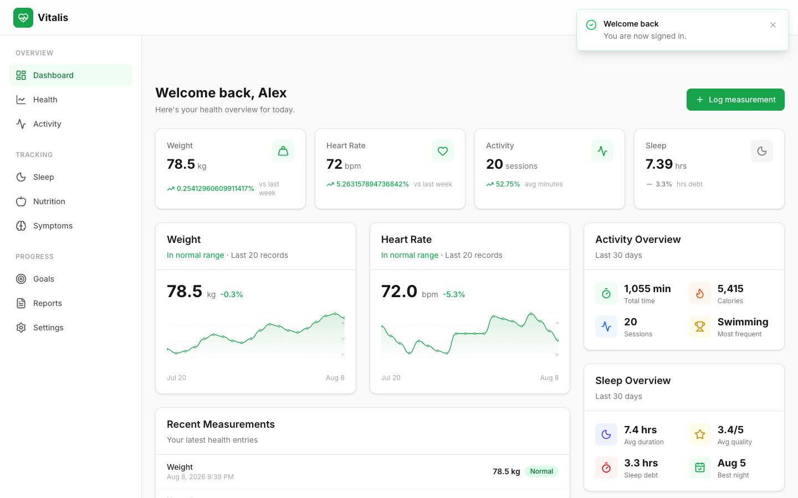
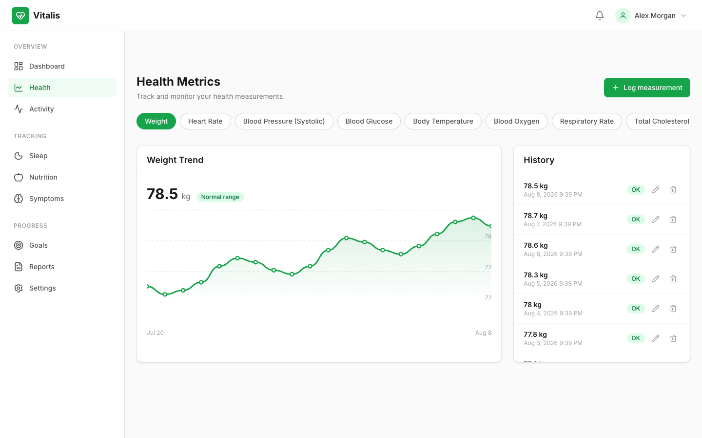
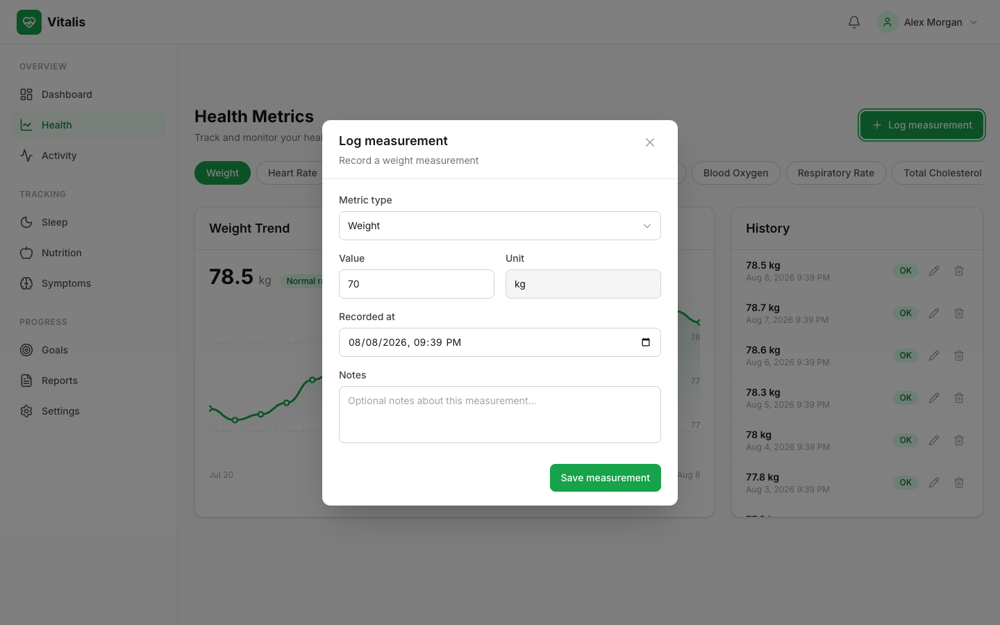
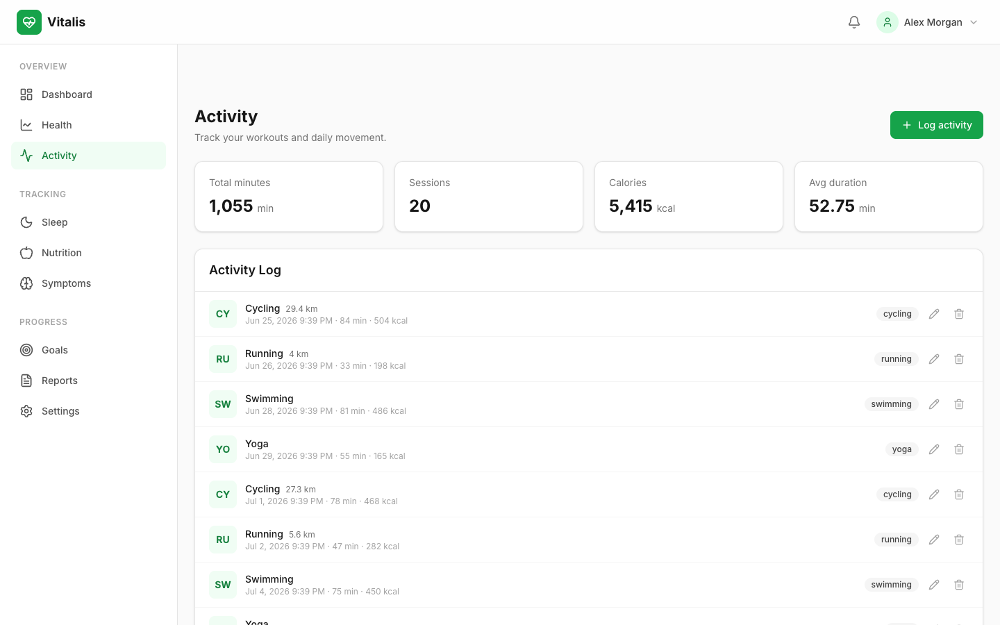
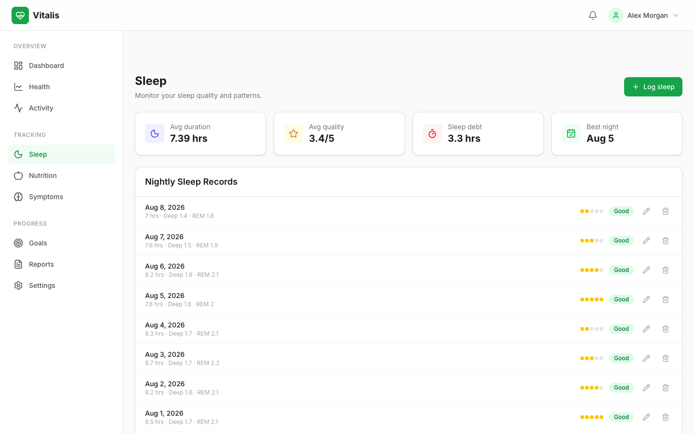
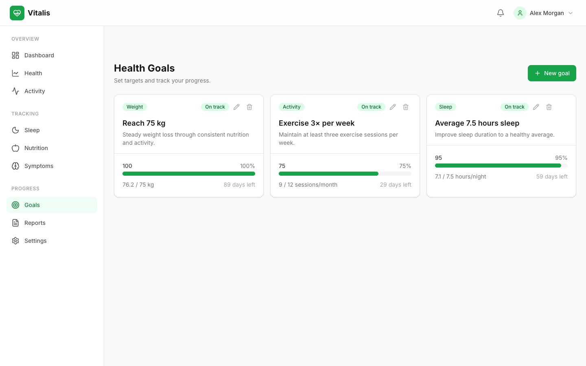
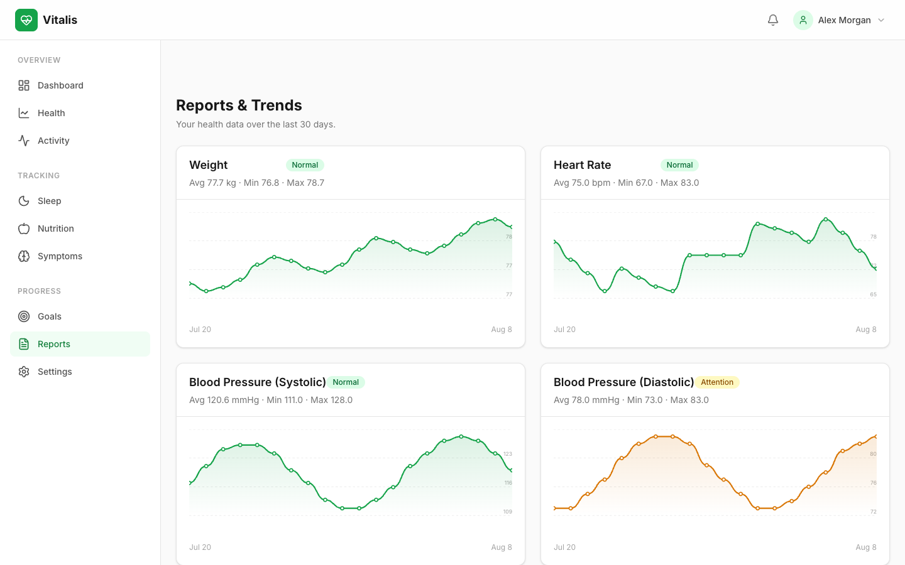
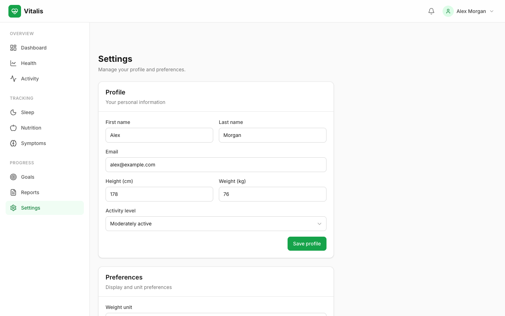
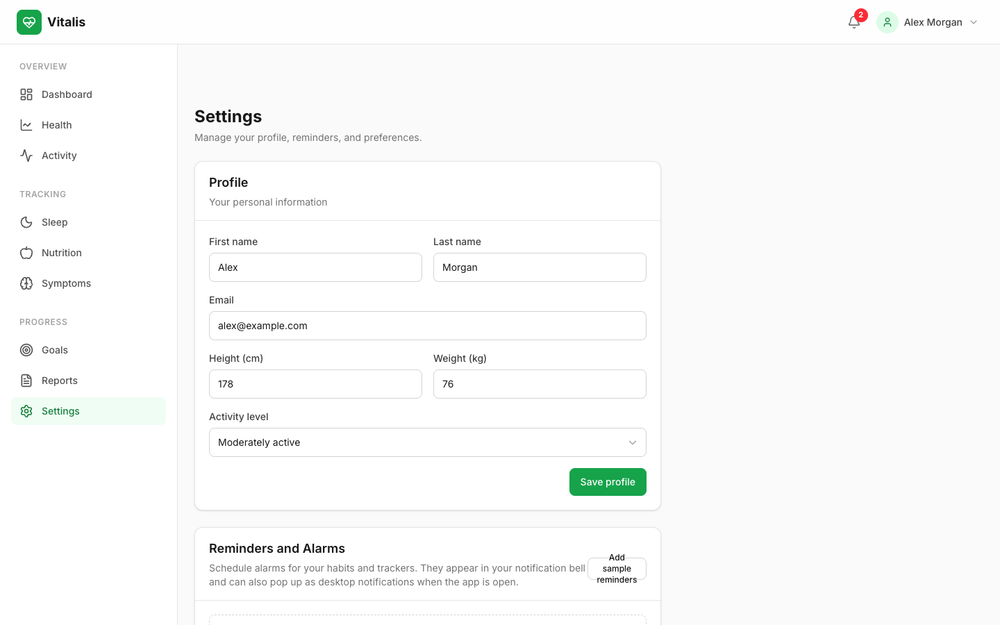
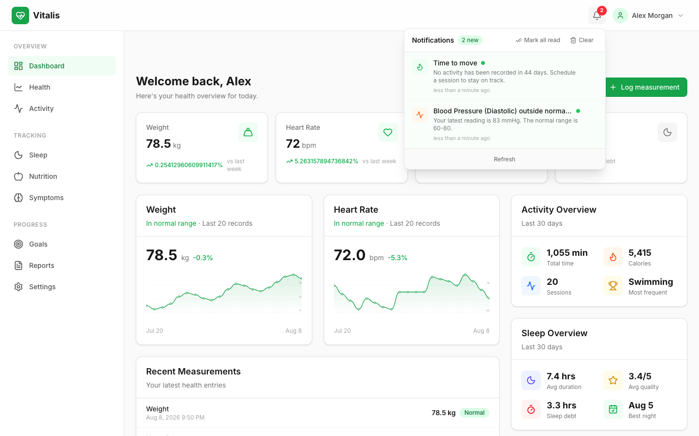

# Vitalis Health Tracker

Vitalis is a full-featured personal health tracking web application. It lets people create their own account, log health measurements, record workouts, track sleep, and set health goals. Every piece of data in the application is editable. Each account stores its own data privately.

## Live Demo

The application is deployed and publicly accessible. You can try it at the link below.

[View the live application](https://health-tracker-rho-six.vercel.app)

A demo account is preloaded with sample data so you can explore the dashboard immediately.

| Field | Value |
| --- | --- |
| Email | alex@example.com |
| Password | DemoPass123 |

You can also create a new account from the registration page. New accounts start empty and every page guides you to add your first measurement, activity, sleep record, or goal. The demo account is the only one that comes with sample data.

## Screenshots

### Dashboard

The dashboard brings together your latest weight, heart rate, activity, and sleep into one view. It also shows recent measurements and your active goals.



### Health Metrics

Track twelve types of measurements including weight, heart rate, blood pressure, blood glucose, and body temperature. Charts show your trend over the last 30 days.



Logging a measurement is simple. Choose the metric type, enter the value, and save.



### Activity Log

Record workouts such as running, cycling, swimming, and gym sessions. The summary shows your total minutes, calories burned, and session count.



### Sleep Tracking

Log nightly sleep with duration and quality. The overview shows your average duration, average quality, and sleep debt.



### Health Goals

Set targets for weight, activity, sleep, and more. Progress bars show how close you are to each target.



### Reports and Trends

Compare all of your metrics side by side over the last 30 days.



### Settings

Update your profile details, schedule reminders and alarms, and adjust your unit preferences.



Reminders can be set for habits, trackers, activity, sleep, and goals. Each one runs on a daily, weekday, or weekend schedule.



### Notifications

The bell in the top bar opens a notification center. It alerts you when a measurement is outside its normal range, a goal falls behind, or sleep debt is building. Unread items are counted on the bell, and reminders show up here when they are due.



## Features

- Account creation, sign in, and sign out for multiple users
- Passwords stored as hashed values using SHA-256
- Each account has its own private set of health data
- Track 12 health metric types with normal range indicators
- Interactive trend charts built with SVG (no chart library dependency)
- Activity logging with type, duration, distance, and calories
- Sleep logging with duration and quality ratings
- Goal creation with automatic progress calculation
- Edit and delete for every health metric, activity, sleep record, and goal
- Status alerts in the notification center for out of range readings, off track goals, and sleep debt
- Reminders and alarms that run on daily, weekday, or weekend schedules
- Desktop notifications for reminders when permission is granted
- Fully responsive layout that works on mobile, tablet, and desktop
- Client side validation with descriptive error messages
- Loading states and toast notifications for every user action
- Data persists in the browser across page reloads

## Technology Stack

The application is built from scratch without a backend framework. All data handling runs in the browser and is stored in local storage.

| Layer | Technology |
| --- | --- |
| Language | TypeScript |
| UI library | React |
| Build tool | Vite |
| Styling | Tailwind CSS |
| Routing | React Router |
| Forms | React Hook Form |
| Validation | Zod |
| State management | Zustand |
| Icons | Lucide React |
| Tests | Vitest and Testing Library |

## Getting Started

### Prerequisites

- Node.js version 20 or newer
- npm

### Installation

```bash
npm install
```

### Run in development

```bash
npm run dev
```

Open http://localhost:3000 in your browser. The first visit creates a demo account and seeds sample data.

### Run in production mode

```bash
npm run build
npm run preview
```

### Run tests

```bash
npm test
```

### Run the linter

```bash
npm run lint
```

### Type check

```bash
npm run typecheck
```

## Project Structure

```
health-tracker/
├── src/
│   ├── components/       Reusable UI components
│   │   ├── ui/           Design system primitives
│   │   ├── layout/       Navigation and shell
│   │   ├── dashboard/    Dashboard widgets
│   │   └── health/       Health specific forms
│   ├── pages/            Route level pages
│   │   ├── auth/         Sign in and registration
│   │   ├── dashboard/
│   │   ├── health/
│   │   ├── activity/
│   │   ├── sleep/
│   │   ├── goals/
│   │   ├── reports/
│   │   └── settings/
│   ├── lib/              Core libraries
│   │   ├── api/          Data access layer
│   │   ├── auth/         Account handling
│   │   ├── health/       Health calculations
│   │   ├── analytics/    Trend calculations
│   │   ├── validation/   Validation schemas
│   │   └── utils/        Shared utilities
│   ├── services/         Business logic
│   ├── hooks/            Reusable hooks
│   ├── store/            Global state
│   ├── database/         Data seeding
│   ├── types/            TypeScript types
│   └── tests/            Automated tests
├── docs/                 Documentation and screenshots
└── public/               Static assets
```

## How Data Works

The application has no server. Data is stored in your browser using local storage and is separated by account. When you sign in, you only see data that belongs to your account.

- `health-tracker:users` stores registered accounts
- `health-tracker:session` stores your active session
- `health-tracker:metrics` stores health measurements
- `health-tracker:activity` stores workout records
- `health-tracker:sleep` stores sleep records
- `health-tracker:goals` stores health goals
- `health-tracker:notifications` stores your status alerts and reminders
- `health-tracker:reminders` stores your scheduled reminders

The data access layer in `src/lib/api` behaves like a remote API. It adds realistic latency, returns typed errors, and supports pagination and sorting. This keeps the rest of the application structured as if a real backend were present, which makes swapping in a server later straightforward.

## Scripts

| Command | Purpose |
| --- | --- |
| `npm run dev` | Start the development server |
| `npm run build` | Create a production build |
| `npm run preview` | Preview the production build |
| `npm test` | Run the automated test suite |
| `npm run lint` | Run the linter |
| `npm run typecheck` | Run the TypeScript checker |

## License

This project is available for public use and demonstration purposes.
